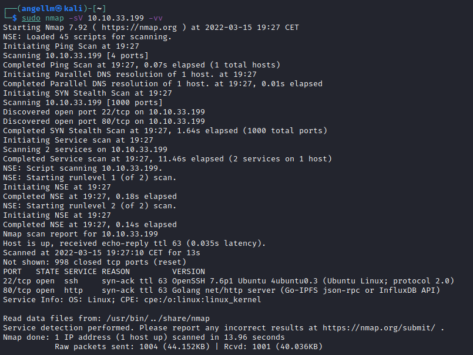

# EN - Overpass - Writeup
What happens when a group of broke Computer Science students try to make a password manager? Obviously a *perfect* commercial success!


**Date**: 15/03/2022

**Difficulty**: Medium

**CTF**: [https://tryhackme.com/room/overpass](https://tryhackme.com/room/overpass)

---

# Hack the machine and get the flag in user.txt

First of all, let’s scan the target using nmap:

```bash
sudo nmap -sV 10.10.33.199 -vv
```



We found 2 open ports, the ssh one (22) and the http (80). Let’s see if the http server is hosting a website by visiting the ip address using the web explorer.


Yep, it does. There would be something left in the source code?


Nothing interesting. But we have discovered the existence of some folders: `/aboutus`, `/downloads`, `/img` y `/css`

`/aboutus`


The Staff names could be usernames, so let’s remember them: Ninja, Pars, Szymex, Bee, MuirlandOracle.

`/downloads` 

In this page we can download the binaries of the Overpass software, the source code and what it seems to be a compiling script.

In the source code of the html page, we discover two new folders: `/builds` y `/src`


`/builds`


`/src` 


`/img`


 This page contains an Index of image files. But none of them seems to be interesting.

`/css` 


This page shows an index of css files. The one named login.css catchs my attention, maybe there’s a login page?

I try with `/login` without success, but `/admin` works:


There is a login form. I’m going to try the username Ninja and for the password... In the source code of the login form, the username and password fields have the property “required”. It would work if I delete that property from the password field?


No, it doesn’t work. I had to try...

I try with XSS (using a simple alert script) and nothing happens.
I try with SQL injection, writing `'OR 1=1;--` in both username and password fields but nothing occurs.

Maybe I have not discovered every accesible folder of the website, let’s scan it using gobuster:

```bash
gobuster dir -u http://10.10.33.199 -u /usr/share/wordlists/dirbuster/directory-list-lowercase-2.3-small.txt -x html, php, txt
```


Nothing useful. Let’s see if the webpage is loading something we can use...

Yes, the login page is loading 2 javascripts: `cookie.js` and `login.js`.

The cookie.js script seems to be an standard script. But the login.js script looks custom. Let’s see the code:

```jsx
HTTP/1.1 200 OK
Accept-Ranges: bytes
Content-Length: 1779
Content-Type: application/javascript; charset=utf-8
Last-Modified: Sat, 27 Jun 2020 03:22:54 GMT
Date: Tue, 15 Mar 2022 20:14:52 GMT
Connection: close

async function postData(url = '', data = {}) {
    // Default options are marked with *
    const response = await fetch(url, {
        method: 'POST', // *GET, POST, PUT, DELETE, etc.
        cache: 'no-cache', // *default, no-cache, reload, force-cache, only-if-cached
        credentials: 'same-origin', // include, *same-origin, omit
        headers: {
            'Content-Type': 'application/x-www-form-urlencoded'
        },
        redirect: 'follow', // manual, *follow, error
        referrerPolicy: 'no-referrer', // no-referrer, *client
        body: encodeFormData(data) // body data type must match "Content-Type" header
    });
    return response; // We don't always want JSON back
}
const encodeFormData = (data) => {
    return Object.keys(data)
        .map(key => encodeURIComponent(key) + '=' + encodeURIComponent(data[key]))
        .join('&');
}
function onLoad() {
    document.querySelector("#loginForm").addEventListener("submit", function (event) {
        //on pressing enter
        event.preventDefault()
        login()
    });
}
async function login() {
    const usernameBox = document.querySelector("#username");
    const passwordBox = document.querySelector("#password");
    const loginStatus = document.querySelector("#loginStatus");
    loginStatus.textContent = ""
    const creds = { username: usernameBox.value, password: passwordBox.value }
    const response = await postData("/api/login", creds)
    const statusOrCookie = await response.text()
    if (statusOrCookie === "Incorrect credentials") {
        loginStatus.textContent = "Incorrect Credentials"
        passwordBox.value=""
    } else {
        Cookies.set("SessionToken",statusOrCookie)
        window.location = "/admin"
    }
}
```

The login function is the most interesting. This funtion use the form data and send them via POST to the login API. The API sends back the response, and the text of this response is stored in the statusOrCookie variable. After that the scripts checks if the text stored in this variable is equal to “Incorrect Credentials”, if it is the webpage shows an message saying the credentials are not valid. If the content of the variable is any other, the scripts creates a cookie named SessionToken with the value of statusOrCookie and after that it redirects us to /admin.

We do not really know a valid value of the SessionToken value, but we can try to create a cookie with that name and a random value>


Let’s reload the login page and see if it works”:


Yay! It shows us a RSA key with a message for James.

Let’s save the key in the file id_rsa and try to login via ssh using the username james and the id_rsa key.


Apparently the key has bad permissions... What does it means?


Yep, my bad, I have forgotten that this kind of keys are protected by password. I’ll try to crack it with John The Ripper:


Gotcha. Let’s try to login again:


Sucess! Let’s see what we have in the default folder:


Bingo, the user.txt has the flag we were looking for.

# Escalate your privileges and get the flag in root.txt

Now we have to escalate our privileges in order to find the root flag.

What commands can we execute using sudo?


Agh, no one because we don’t know the james password... It’s not the one we cracked before...

Can we read /etc/passwd y /etc/shadow?


passwd yes, shadow no.

I’m going to look to the command history just in case:


Nah, there are only the commands I have used.

Let’s look for files with the SUID permission active:


Yeah! There are some. But none of them appears in the GTFOBins list...

Time to look for files with capabilities!


Only one and it won’t work for privesc.

May be the kernel system vulnerable to any exploit?


I have found a vulnerability for this kernel to do privesc locally but it is not very popular... I have noted it just in case: **[2018-18955](https://nvd.nist.gov/vuln/detail/CVE-2018-18955)**

There is any cronjob?


There is one and it looks good. Each minute the crontab downloads the [buildscript.sh](http://buildscript.sh) from the url overpass.thm/downloads/src and send it to the bash.

Let’s see what the script does...

I try to visit the page overpass.thm/downloads/src/buildscript.sh from my pc but nothing appears. Let’s assume it’s the same script you can download from the target webpage. This is the code:

```jsx
GOOS=linux /usr/local/go/bin/go build -o ~/builds/overpassLinux ~/src/overpass.go
## GOOS=windows /usr/local/go/bin/go build -o ~/builds/overpassWindows.exe ~/src/overpass.go
## GOOS=darwin /usr/local/go/bin/go build -o ~/builds/overpassMacOS ~/src/overpass.go
## GOOS=freebsd /usr/local/go/bin/go build -o ~/builds/overpassFreeBSD ~/src/overpass.go
## GOOS=openbsd /usr/local/go/bin/go build -o ~/builds/overpassOpenBSD ~/src/overpass.go
echo "$(date -R) Builds completed" >> /root/buildStatus
```

The last line of the script seems to be useful. The $(date -R) is executing the date binary (located in path). I think that if I’m able to create a file named date in a PATH folder I could escalate privileges.

I have write permissions in any PATH folder?


Nope... And I can edit the PATH variable?


Yes! I added my home folder to the beggining of the PATH variable, so I can create there the script that the buildscript executes!


Now we start a netcat listener in our machine and cross fingers...

Ok, it doesn’t work. After investigating, the problem is that the crontab has his own PATH variable defined. It doesn´t matter if we change the global PATH variable, the crontab would execute the scripts using its own PATH variable...

Ok, we know that the crontab downloads the script... but from where? Let’s look at `/etc/hosts` to see if there is any custom domain there:


And it is, overpass.thm is being redirected to 127.0.0.1 (localhost). If we can edit /etc/hosts file we could replace the IP with our machine IP and make the crontab downloads a script made by us instead of the original one.


I have write privileges in the /etc/host file. So let’s modify it and place our IP there:


After modifying the file I have tested the connection by simply doing a ping to the overpass.thm domain.

Now let’s create a malicious script in our machine, we would have to replicate the folder schema of the original domain. 


I have written a script to enable SUID permissions in /bin/bash binary, so we will be able to launch a bash with root privileges using the james user.

Let’s enable all permissions to the script (I don’t think this is necessary) and after that I create a http server in the main folder using python:


In less than a minute, a connection appears to get the script. Let’s see if it worked in the target machine.

Before the script execution, the permissions of /bin/bash were:


And after the script execution these are the permissions of the /bin/bash binary:


Those `s` indicate that the SUID permission is enabled and that we can execute the binary using the file owner permissions:


It’s necessary to add the `-p` option to mantain the owner privileges when running the binary.


Finally, after some navigation, I found the root.txt file.