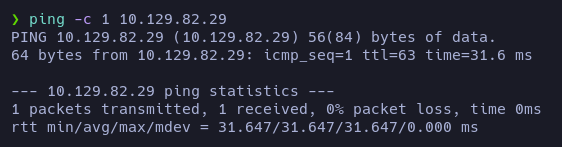

# Trick - Writeup

**Date**: 25/06/2022

**Difficulty**: Easy

**CTF**: [https://app.hackthebox.com/machines/Trick](https://app.hackthebox.com/machines/Trick)

---

Let’s start checking the connection with the target machine:

Let’s do an nmap scan to discover opened TCP ports:

Let’s take a look to the http service:

Does the form works?

Apparently no.

Let’s try to found directories in the website:

We obtain a 403 error when we try to see that directories.

Let’s see if we can obtain the DNS from the domain service:

Yeah, the DNS is trick.htb, let’s add it to the /etc/hosts file:

The website looks the same, but now we can enumerate for subdomains:

Nothing for the top1million-5000.txt neither for 20000 one.

Let’s see what can we do with the port 25 (SMTP):

Let’s enumerate the DNS:

[https://book.hacktricks.xyz/network-services-pentesting/pentesting-dns](https://book.hacktricks.xyz/network-services-pentesting/pentesting-dns)

We got a total of 3 subdomains:

- `trick.htb`
- `root.trick.htb`
- `preprod-payroll.trick.htb`

Let’s add them to /etc/hosts and visit them.

`root.trick.htb` goes to the same page as `trick.htb`

But preprod goes to this page:

I tried with some common credentials with no success. The error message will not be helpful to enumerate valid usernames, let’s check if it vulnerable to SQLi

Yes, it is. Now we are inside a control panel.

So, apparently the Administrator username is `Enemigosss`. We can edit the profile:

The value of the password field can be seen in cleartext if we inspect the code, but we can also see it in the form if we delete the attribute `type=password` from the textbox:

So, we have credentials: `Enemigosss:SuperGucciRainbowCake`

Let’s see if they have reused them and we can log in via ssh:

Nope.

Ok, it was a preprod of payroll website… Maybe there will be other preprod sites? Let’s find out:

Yeah, at least there is a marketing preprod. Let’s add it to the /etc/hosts file and visit it:

It seems to be including the pages via inclussion… LFI maybe?

It doesn’t allow us to incluse de /etc/passwd file, maybe we cannot use this way.

Let’s try to discover directories for this subdomain:x.php?page=index.php

Going a step back, I found a LFI in the preprod-payroll website. Using the php filter wrapper I’m able to leak the content of certain things encoding it to b64:

`php://filter/convert.base64-encode/resource=index`

There are interesting things here:

This is how it includes the pages, it looks for the `page` parameter and it adds the `.php` file extension. If we want to include other kind of files, we should find the manner to avoid the file extension.

This part of the code is interesting because it leaks some php files. `auth.php` may contain credentials? Let’s take a look:

`http://preprod-payroll.trick.htb/index.php?page=php://filter/convert.base64-encode/resource=auth`

Apparently it doesn’t exists.

Let’s take a look to `users.php`:

Apparently it query the users from a database. To do it, it includes a php file called `db_connect` let’s check it:

So… more credentials: `remo:TrulyImpossiblePasswordLmao123`, let’s add it to the credentials list. 

This credentials are not valid for ssh neither.

After trying some techniques to try path traversal I haven’t found a valid way to do it. So let’s investigate the preprod-marketing site:

The version of jquery (3.4.1) is vulnerable to XSS:

The only input I have found on the website is this contact form. 

So, I deployed a http server in my machine, listening on port 80 and tried to catch a get, with no success.

There is another strange thing, the URL:

It looks like the LFI we exploited earlier, but the wrappers doesn’t work. Let’s try path traversal…

Yeah! At first I had no success, because probably the server is filtering the string `../` so, using `....//` instead solved the problem.

At `passwd` file we can see a user named `michael`. Let’s try to connect via ssh using this username and the passwords obtained before:

Nope.

Let’s try to catch the flag using the LFI:

Flag found.

But we need to gain access! Let’s see if this user has some ssh credentials:

Bingo!

Yay! We’re inside >:D

Now let’s find the way to escalate privileges

To test it, I executed pspy in the target machine and tried to access via ssh with root username and a random password several times:

After some tries, this happened:

Looking for the file that executes the iptables command I found the file `iptables-multiport.conf`, inside there is something called `actionban`

It’s the iptables command we saw earlier. So, let’s try to modify this, restart the service and trigger the ban to see if we can gain a revshell!

And that’s how I got the root flag!