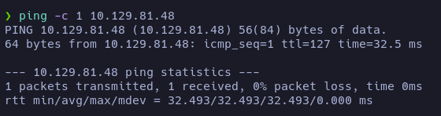

# Active - Writeup

**Date**: 27/06/2022

**Difficulty**: Easy

**CTF**: [https://app.hackthebox.com/machines/148](https://app.hackthebox.com/machines/148)

---

Let’s start with the classic ping to test the connection with the target machine:

1 packet emitted, 1 packet received. The ttl shows a value of 127 which in HTB means that we are probably against a Windows machine.

Let’s do a scan of the TCP ports to find which ones are open:

Wow, it shows a bunch of open TCP ports. Let’s do a further scan in these ports:

We have much information here. First of all we have kerberos, RPC and ldap services. We also have a DNS service in port 53 and a http service running on port 47001.

Let’s see if we can any info from the DNS service:

Apparently nothing… Let’s see the http service:

Ok, we also have the port 445 open which is usually used by SMB… Let’s try to obtain more info using crackmapexec:

If we search the Build version, we can find that the target server is a Windows Server 2008 R2, SP1.

Now we know that the domain is `active.htb` let’s add it to the `/etc/hosts`.

But the http service looks the same.

Let’s try to enumerate the smb:

We have READ permissions to the folder Replication. Let’s look inside!

Every folder at this level was empty.

It seems like it may have interesting files… let’s download all the folder to navigate more quickly:

`smbget -R smb://10.129.81.48/Replication`

Maybe we have credentials here?

`active.htb\SVC_TGS : edBSHOwhZLTjt/QS9FeIcJ83mjWA98gw9guKOhJOdcqh+ZGMeXOsQbCpZ3xUjTLfCuNH8pG5aSVYdYw/NglVmQ`

Is not that simple… Let’s see if the username at least is valid using kerbrute:

Yes, it is. So we have a valid username but not its password I guess.

Doing some research, I found [this](https://vk9-sec.com/exploiting-gpp-sysvol-groups-xml/):

So the password seems to be encrypted in AES-256 and we can crack it using gpp-decrypt.

`SVC_TGS:GPPstillStandingStrong2k18`

Let’s save this credential in a file.

And now let’s test it:

Yes, it’s valid!

Now, using this credentials we have access to more folders. Let’s look into `Users`:

Can we list the Administrator folder?

Nope. Let’s try with the rest:

Apparently the userflag is in `Users/SVC_TGS/Desktop` path. Let’s download it!

After enumerate the SMB I have found nothing else interesting, let’s try to do a `ldapdomaindumpH`

Como vimos antes, se trata de un Windows Server 2008 R2 SP1.

Apparently there are only 4 users

- SVC_TGS: we have its credentials
- krbtgt: Key Distribution Center Service Account
- Guest
- Administrator

Let’s try a Kerberoast attack:

`❯ sudo python3 /home/angellm/THM/CTF/Relevant/impacket/build/scripts-3.9/GetUserSPNs.py active.htb/SVC_TGS:GPPstillStandingStrong2k18 -dc-ip 10.129.104.47 -request`

Let’s now try to crack the hash using hashcat:

`hashcat -m 13100 -a 0 kerberoast_result /usr/share/wordlists/rockyou.txt`

Cracked! The password was `Ticketmaster1968`

Let’s see if this credentials are correct: `Administrator:Ticketmaster1968`

Yeah, Pwned! Let’s go for the root flag:

Done!