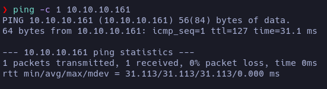

# Forest - Writeup

**Date**: 30/06/2022

**Difficulty**: Easy

**CTF**: [https://app.hackthebox.com/machines/Forest](https://app.hackthebox.com/machines/Forest)

---

Let’s start testing the connection with the target machine by sending a ping:



The ttl confirms that we are against a Windows Machine. Let’s move to the nmap scan to see if there are any TCP port open:


There are many ports open! Let’s do a detailed scan to these ports:


Let’s start with the SMB (port 445). I’ll use crackmapexec to gather more info:


Let’s see if we can see something inside the SMB without credentials:


Not with smbmap, let’s try it with smbclient


Ok, apparently we cannot access to the SMB… let’s try to find some usernames using kerbrute:


We found some valid usernames! 

Let’s create a list of valid users:


Any of them would be AS-Rep Roastable?


None of the discovered user has the `UF_DONT_REQUIRE_PREAUTH` set, so no AS-Rrep Roast available.

Maybe is not the best idea, but let’s try to obtain a password of a discovered user using Kerbrute:

```bash
#!/bin/bash

File="validusers"
Lines=$(cat $File)
for Line in $Lines
do
	/opt/kerbrute/kerbrute bruteuser --dc 10.10.10.161 -d htb.local -t 200 /usr/share/seclists/Passwords/xato-net-10-million-passwords-10000.txt $Line
done
```

or do it with a one liner:

`cat validusers | while read LINE; do /opt/kerbrute/kerbrute bruteuser --dc 10.10.10.161 -d htb.local -t 200 /usr/share/seclists/Passwords/xato-net-10-million-passwords-10000.txt $LINE; done`


But nah, no password has been discovered using this usernames and the password dictionary…

Let’s take a look to the ldap.

First of all, let’s see if it allows anonymous binds. To do so I can use `ldapsearch` tool:

`ldapsearch -H ldap://10.10.10.161:389 -x -b "dc=htb,dc=local”`


The -x flag is used to specify anonymous authentication, while the -b flag denotes the base dn to start from. We were able to query the domain without credentials, which means null bind is enabled.
Now we can use `windapsearch` to obtain more info from the domain:

`/home/angellm/repos/windapsearch/windapsearch.py -d htb.local --dc-ip 10.10.10.161 -U`

- `-U` : Enumerate all users, i.e. objects with objectCategory set to user.


These users are the ones that we previously had… let’s try to obtain even more info using the flag `--custom "objectClass=*"` in order to obtain all the objects in the domain


The object `svc-alfresco` catches my attention. Let’s google it:

[Set up authentication and sync](https://docs.alfresco.com/content-services/7.0/admin/auth-sync/)


So… this account seems to not require Kerberos preauthentication so… maybe we can get a valid TGT form it via AS-REP Roast:


Yeah, we got a NTLM hash of the user svc-alfresco. Let’s try to crack it using john:


Yeah, we have a password. Let’s see if it is valid using crackmapexec:


Yes, its a valid credential: `svc-alfresco:s3rvice`

As we have a valid credential and there is a winrm service active in the port 47001, maybe we can try to gain access to target machine using `evilwinrm`:


Yeah, we obtained a PowerShell. Let’s look for the user flag:


Nice.

Now is time to escalate privileges. Let’s see which privileges this user has:


And let’s see also the groups this account is in


I see nothing to use. But let’s use Bloodhound to see it more clearly:


When imported into BloodHound it I searched SVC-ALFRESCO user and marked as OWNED.


Double clicking on this user I see that it’s included in 9 groups:


So, I click on the number 9 to display them:


Mmmm… That group called ACCOUNT OPERATORS looks interesting. Apparently, members of this group are allowed create and modify users and add them to non-protected groups. So maybe we can use that.

Let’s go to the Analysis “Shortest Paths to High Value Targets”


Is a little bit messy. One of the paths shows that the Exchange Windows Permissions group has WriteDacl

privileges on the Domain. The WriteDACL privilege gives a user the ability to add ACLs to an

object. This means that we can add a user to this group and give them DCSync privileges.


And now we can use secrets-dump to see the hashes!


This is the hash of the administrator account: `32693b11e6aa90eb43d32c72a07ceea6`

We can perform a pass the hash attack to log in as the administrator:


Yeah, we are logged as Administrator. Now is time to search the root flag:

