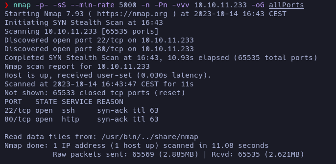
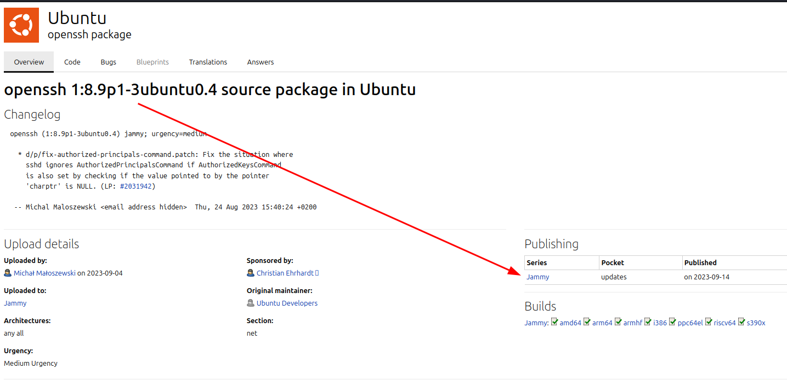

# Analytics - Writeup

**Date**: 14/10/2022

**Difficulty**: EASY

**CTF**: [https://app.hackthebox.com/machines/Analytics](https://app.hackthebox.com/machines/Analytics)

---

# Enumeration

Let's start by scanning the open TCP ports of the target machine:



**nmap** reported tcp ports 22(ssh) and 80(http) to be open. Let's scan them further:


**nmap** exhaustive scan reported that the service running on port 22 is OpenSSH 8.9p1. According to lauchpad, the target machine OS may be Ubuntu Jammy:



Regarding the http service on port 80, the service running is **nginx 1.18.0**. The scan also reported that a redirection may be being applied to http://analytical.htb, so the server may be applying virtual hosting. Before adding this domain to the **/etc/hosts** file, let's check quickly the petition to the website using Burpsuite:


As we can expect, the website is applying the redirection, and there is no information here we can use. So, let's add the domain to **/etc/hosts** file:


The **nmap** script **http-enum** didn't find any common file in the server.

Let's see what technologies are being used in the website apart from nginx:


The **whatweb** tool reports 2 email addresses (demo@analytical.com and due@analytical.com). It also reports that the website is using JQuery v3.0.0. This version of JQuery is outdated and is vulnerable to XSS.


Let's see how this page looks using the browser:


There is a section called "Our Team" that shows photos, names and positions of workers. Let's write down this data that may be useful to check usernames.


```

Jonny Smith - Chief Data Officer

Alex Kirigo - Data Engineer

Daniel Walker - Data Analyst

```


There is a contact form at the bottom on the page that doesn't seem to work.

By hovering the top menu "Login" link we can see that it will redirect us to http://data.analytical.htb


Let's add this subdomain in the **/etc/hosts** file.


Now, let's click on the link:


It redirects us to a website where there is a service called Metabase. Let's search what is this:


# Exploitation

After some research, I found this interesting blog entry at MetaBase's official webpage:

https://www.metabase.com/blog/security-incident-summary\

In this blog is explained that there were some programming errors that made the application vulnerable in older versions of it. 


Checking for the setup token in the website of the target machine I found it:


So, maybe the version of MetaBase is outdated and it is vulnerable.

I found this script written in Python that automates the exploitation process: https://github.com/robotmikhro/CVE-2023-38646


After exploiting it, we gained a reverse shell!


But it seems that we are inside a docker container. Let's see how can we escape from it.

# Docker breakout

If we check the environmental variables with `env`:


We can find the credentials `metalytics:An4lytics_ds20223#`.

Let's try to check if they are valid to connect to the target machine via ssh:

Yes, the credentials are valid.


And that's how we got the user flag

# Privilege Escalation

Let's see the version of the Ubuntu and the kernel:


It's an Ubuntu jammy, as we guessed in the enumeration phase. The Linux kernel is 6.2.0.

If we search for vulnerabilities of this kernel, we find this page: https://www.wiz.io/blog/ubuntu-overlayfs-vulnerability

In that article is explained that multiple versions of the linux kernel have a vulnerability related to the OverlayFS module that can be used to perform a Privilege Escalation. Apparently a similar vulnerability was detected and fixed back in 2021, but it happened again.


According to the article, the version of the kernel that the target Ubuntu is using is vulnerable.


The article also says that the old exploits still work for this vulnerability, so I'm going to use this one I found:

https://github.com/briskets/CVE-2021-3493

So, I downloaded the .c file and compiled it in my machine. Then I shared it with the target machine using an http server:


Then, from the target machine, I downloaded the compiled exploit, gave it execution permissions and executed it.


And this way I escalated privileges to root easily and read the root flag.


# New things learned

- The **environmental variables** should be checked every time.

- It's important to check the OS and kernel version and look for vulnerabilities.

