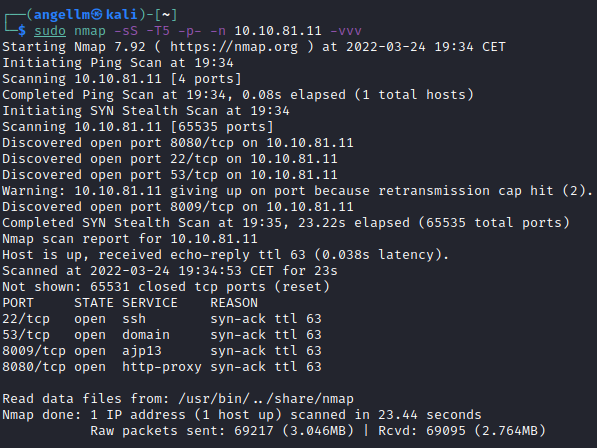

# tomghost CTF - Writeup

Are you able to complete the challenge?

**Date**: 24/03/2022

**Difficulty**: Medium

**CTF**: [https://tryhackme.com/room/tomghost](https://tryhackme.com/room/tomghost)

# Compromise this machine and obtain user.txt

First of all, let’s do a quick scan of the open ports of the target:

Nmap discovers 4 open ports: 22, 53, 8009 and 8080 let’s do a proper scan to those ports:

Let’s see if there is anything in the port 8080 we can view using the web browser:

So, it seems like the owner of the target system has been installed tomcat recently. The version installed is the 9.0.30. Let’s see if we find any vulnerability that allow us to exploit the target.

As we can see in the fixes of newer versions of Tomcat, there were some important vulnerabilities with the version 9.0.3. Let’s check exploit database to see if there is any exploit we can use.

Looking for the CVE-2020-1938 a exploit appears:

Let’s use it with msfconsole:

Let’s configure it:

The RHOSTS parameter is the IP adress of the target, but I’m not sure about the File name, so I’ll keep it as it is and try once:

How lucky! We obtained what it looks like a username and a password hash! Let’s try to crack it using John The Ripper! But first, we should discover in which format has the password been hashed:

Strange, I supposed it to be a password hashed, not a password in plain text... In the first scan we have seen that there is a ssh service open, let’s try to log in with this credentials:

Woah, it worked... Let’s look around for the user.txt file

It catched my eye the .asc and .pgp files

Let’s see if we can use the tryhackme.asc key to de-encrypt the credential.pgp file:

The key has a password, let’s transfer the key file to our machine and try to crac;k the password using John The Ripper:

Before trying to crack it with John The Ripper we have to convert the file using `gpg2john`

And then, let’s try to crack it!

We got the password in no time. Let’s go back and try to find the user.txt file first:

Let’s see if we can read it with the current user:

Yes, we can and that’s how we get the first flag of this CTF.

# Escalate privileges and obtain root.txt

It’s unlikely, but let’s see if we can find the root.txt file with the current user:

Nope, let’s de-encrypt the credential.gpg file:

we got what it looks like a username and password again? Let’s try to switch to that user:

We can’t, I double checked. It would be the ssh password? Let’s try:

It is. Let’s see if this user has permissions to read the /root folder:

Nope... So we have to do more privesc. Let’s see if this user can run sudo commands:

Niiice, so we can run zip as root! This is exploitable for sure, let’s check it out at GTFOBins:

Let’s try it!

It worked! Let’s find the root flag!

And that’s it! I’ve been lucky finding the sudo permission at first try!