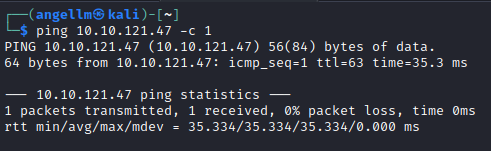

# Daily Bugle - Writeup

**Date**: 04/04/2022

**Difficulty**: Hard

**CTF**: [https://tryhackme.com/room/dailybugle](https://tryhackme.com/room/dailybugle)

---

# Deploy

## Access the web server, who robbed the bank?

First of all, a quick scan:

Ping tell us that it will be a linux machine (ttl=63)

A quick nmap scan discover that ports 22, 80 and 3306 are open.

A more detailed nmap scan shows us the version of the services.

For the http service it also discovered that the site uses Joomla, and that robots.txt file exists and has several directories configured as disallowed entries, we may check them all later.

For now, let’s visit the page:

# Obtain user and root

## What is the Joomla version?

<aside>
💡 Instead of using SQLMap, why not use a python script!
</aside>

As I have never used SQLMap before, I’m going to do it with a python script first and then I’ll find how to do it with SQLMap:

### Python Script

Doing a bit of research I found [Juumla Github repository](https://github.com/oppsec/juumla). This tool is a python script that discovers the version of a Joomla site.

So let’s clone the repository in our local machine and follow the instructions:

Pretty fast!

### SQLMap

After some research I didn’t find a way to do it with SQLMap... Maybe that phrase was referring to the next task?

### Other

There is other way to obtain the Joomla version according to [this site](https://www.itoctopus.com/how-to-quickly-know-the-version-of-any-joomla-website). As it says, is as easy as navigate to this url: `[http://10.10.121.47/administrator/manifests/files/joomla.xml](http://10.10.121.47/administrator/manifests/files/joomla.xml)` and a config file appears where you can easy see the Joomla version:

## What is Jonah's cracked password?

Looking for any exploit for this Joomla version, the results are aligned, there is a SQL Injection vulnerability in this version we can exploit.

So, let’s try with the [python script of stefanlucas](https://github.com/stefanlucas/Exploit-Joomla) first:

Nice, now we have to crack the password. To do it we should know the hash format... Let’s discover it:

A user in hashcat forum says is bcrypt... It has an avatar of a cat, I should trust on him.

So, let’s try to crack it using John the Ripper, fasttrack wordlist and bcrypt hash format:

After 5 minutes we get a cracked password!

## What is the user flag?

In the nmap scan we did before, it discovered robots.txt file, which had some directories we have taken note. Let’s try to visit the ones that look like an administrator page:

At /administrator we find this login. Let’s try to login as jonah:

We are in. Let’s look for the flag...

After some navigation it doesn’t look like there is a flag inside joomla itself. I think I can upload a php reverse shell and try to catch it on my local machine:

It doesn’t work. Apparently I can’t upload .php files there.

But... I can modify this hahaha

Let’s try again:

Nah, there is no way.

Just for the sake of trying, let’s see if we can login via SSH using this credentials:

Nope, okay. Let’s try again to open a reverse shell. I’m going to search how to upload php files in Joomla.

After some searching, apparently there is no way to upload php files, buuuut, there are php files you can edit: the templates. So let’s try to use them to inject our code there:

I’ll backup all the index.php code to undo it if neccesary, and replace all the cod with the php-reverse-shell.php one:

It will work if I click on preview? Nope. Let’s save it.

And now let’s click on preview, And Instantly we get the reverse shell!

I’m going to stabilize the shell:

Now, let’s look for the flag:

hmmm... we have not access to jjameson folder. Let’s see what can I do with this user:

I have no permissions to read /etc/shadow and there is nothing being executed on crontab.

No interesting SUID binaries, no interesting capabilities binaries, no NFS...

Ok, we know the other user is jjameson. Maybe we can start an hydra attack? I tried for 30 min with no success, so I guess is not the correct way.

Let’s see if there is any vulnerability we can exploit in the apache version 2.4.6. After some research I didn’t find nothing exploitable for privesc.

What about the OpenSSH version 7.4? Nothing neither...

And Maria DB? Nothing? uhm...

Ok, let’s try another thing. Let’s investigate if there is something we can use in the /var/www/html folder which contains the files hosted in the httpd service:

This is interesting, there are credentials of a user “root”. This credentials seems to be for a database service. Maria DB maybe? Let’s check:

`mysql -h <hostname> -u <username> -p <databasename>`

Looks like we cannot access to the database from our local machine. Let’s try with the target machine:

Yeah, we can from target machine. Let’s see what’s inside this DB:

Mmmh... we got this before when we exploited the joomla vulnerability. Maybe we are in the incorrect DATABASE.

I have found nothing interesting through the database. Let’s try this password in the root user of the target machine just in case:

Nope. Let’s try as the password of the jjameson user, just to discard everything:

OMG... it is. Let’s go for the user flag:

## What is the root flag?

Ok, root flag would be probably located into /root folder. This user has no access there, so it’s time for privesc.

Let’s see if we can execute anything using sudo:

We can use yum as sudo... Let’s check it at GTFOBins:

We can escalate privileges using yum!

First way is not possible, as the target system doesn’t recognize fpm as a command. Let’s try with the second option:

This second one worked like a charm (even if I don't fully understand how it works). Now let’s go for the root flag!

And challenge finished!